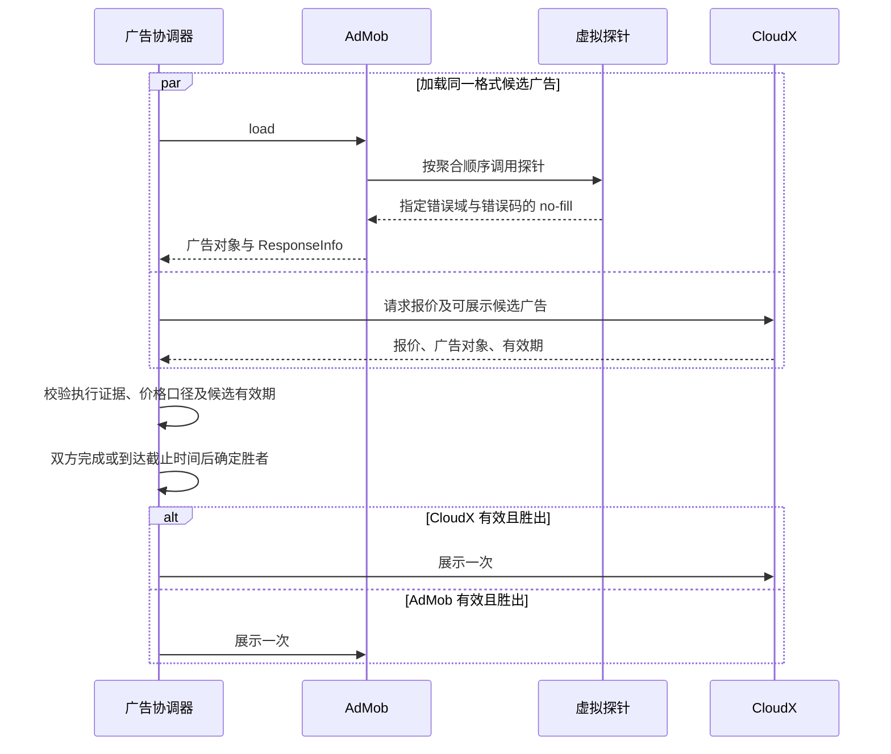

# AdMob 虚拟探针与 CloudX 并行竞价实现方案

更新日期：2026-09-18。适用项目：Mar2SDK Android / Kotlin。

本文依据《CloudX 集成指南：在 AdMob 中使用虚拟探针自定义事件作为价格代理》v3.3（2026-06-23），结合当前仓库及 Google 官方接口文档整理。本文是待实施方案，代码片段用于说明实现方式；本次仅新增文档，未接入 CloudX、修改业务代码或完成真机验证。

## 1. 实现目标与边界

App 并行加载 AdMob 和 CloudX，在展示前根据两侧可用广告及价格信号选择一家展示。

AdMob 的虚拟探针只负责推测胜出广告的**排序价格上界**，不返回广告、不产生展示、不提供真实收益。CloudX 在 App 层参与比较，不是通过这些虚拟探针加入 AdMob 内部竞价。

首期建议只接入插屏，同一广告机会仅比较同一格式的候选广告。插屏验证通过后再扩展激励视频；开屏、横幅等格式需要分别验证适配器支持、展示生命周期及等待成本。

必须区分三类价格：

| 价格类型 | 含义 | 使用方式 |
| --- | --- | --- |
| CloudX 报价 | CloudX 对候选广告提供的有效报价 | 确认币种、单位、分成口径及有效期后参与选择 |
| AdMob 探针代理价 | 根据执行过的探针推测出的排序价格上界 | 仅作为 CloudX 胜出的保守门槛 |
| 展示收益 | 广告实际展示时收到的 paid event 收益 | 用于收入统计和事后评估，保留 precision 信息 |

AdMob 提供公开的展示级收益接口（ILRD）。本方案解决的是“展示前缺少可用报价”，不是“AdMob 没有收益接口”。展示回调不能用来事先选择同一次展示的广告。

## 2. 当前仓库基础与接入位置

当前 `core` 使用 `com.google.android.gms:play-services-ads:25.3.0`。仓库中尚无 CloudX 接入。

| 现有文件 | 当前作用 | 本方案的接入建议 |
| --- | --- | --- |
| [core/build.gradle.kts](../../../core/build.gradle.kts) | GMA SDK、广告适配器依赖，配置 consumer ProGuard 规则 | 引入经确认的 CloudX 依赖；保留虚拟探针适配器类 |
| [AdmobPriceProbe.kt](../../../core/src/main/java/com/mar2sdk/core/ad/impl/admob/AdmobPriceProbe.kt) | 使用针对 SDK 25.3.0 的字段链反射读取展示前价格 | 与本方案分开命名、存储；它不是瀑布流虚拟探针 |
| [AdmobLoader.kt](../../../core/src/main/java/com/mar2sdk/core/ad/impl/admob/AdmobLoader.kt) | 加载广告、保存价格快照、写入缓存池 | 在成功加载后读取 ResponseInfo，为广告对象绑定独立代理价快照 |
| [AdmobShower.kt](../../../core/src/main/java/com/mar2sdk/core/ad/impl/admob/AdmobShower.kt) | 选择缓存广告、控制展示和回调 | 在同格式候选广告上接入协调器，只展示最终选中的对象 |
| [AdShower.kt](../../../core/src/main/java/com/mar2sdk/core/ad/AdShower.kt)、[AdLoader.kt](../../../core/src/main/java/com/mar2sdk/core/ad/AdLoader.kt) | 平台展示与预加载路由，当前实际实现以 AdMob 为主 | 接入 CloudX 加载及统一选择入口 |
| [AdPairSelection.kt](../../../core/src/main/java/com/mar2sdk/core/ad/impl/admob/AdPairSelection.kt) | 双格式候选的并行等待、统一期限及已知价格比较 | 可参考等待机制；不要复用其价格比较器比较上界 |
| [AdmobConfig.kt](../../../core/src/main/java/com/mar2sdk/core/ad/impl/admob/AdmobConfig.kt) | 广告位、缓存有效期和池容量 | 区分缓存 TTL 与新增的竞价等待时限 |
| [AdPlatform.kt](../../../core/src/main/java/com/mar2sdk/core/ad/status/AdPlatform.kt) | 平台标识 | 如需统一平台生命周期，增加 CloudX 平台及对应路由 |
| [AdEventReporter.kt](../../../core/src/main/java/com/mar2sdk/core/log/AdEventReporter.kt) | 广告事件上报 | 新增探针与选择诊断字段，代理价不得上报成 paid revenue |

现有 `AdmobPrice` 保存 `valueMicros`、`currencyCode`、`precisionType`；其中 `valueMicros` 是**单次展示金额的百万分之一**。现有读取器还要求 USD、正数及指定 precision 等条件，但这不意味着所有读取结果都是精确结算价格。

`AdmobLoader.cacheLoadedAd()` 已调用现有反射读取器并按广告对象保存结果。`AdmobShower.showOpenInter()` / `showInterVideo()` 已使用该结果进行跨格式比较：双方价格都存在且次选更高时才选择次选，否则保留首选。单格式展示目前取池首条。

当前 `AppStatus.isShowingAd` 在等待加载阶段就会被占用，不能并行调用两套现有 Shower 来实现竞价。需要把候选加载与统一展示入口分开，明确唯一的锁持有者以及失败、取消、关闭时的释放责任，避免协调器与旧展示逻辑重复占锁。

因此新增代理价不能塞进 `AdmobPrice`，也不能直接替换 `getLoadedPrice()` 的返回值，否则会把价格上界用于“价格越高越优先”的现有排序，改变其语义。

建议新增以下职责，路径和类名均为拟定：

```text
core/.../ad/impl/admob/probe/
  FloorSignalAdapter.kt       自定义事件；被执行后立即返回指定 no-fill
  AdmobProxyReader.kt         读取单次请求的执行证据及代理价
  AdmobProxySnapshot.kt       代理价、状态、配置版本和广告对象关联信息
core/.../ad/auction/
  ParallelAdCoordinator.kt    同格式候选广告的加载、超时、选择和展示协调
core/.../ad/impl/cloudx/
  CloudxAdSource.kt           封装真实 CloudX SDK，接口待供应方确认
```

## 3. 原理与成立条件

### 3.1 用必定失败的广告源充当价格刻度

在一个 AdMob 聚合组中配置手动 eCPM 为 50、30、20、12 的自定义事件。它们与真实来源按本次请求的聚合顺序排列。假设真实胜出来源的排序价格为 25，预期执行过程如下：

| 项目 | eCPM（USD） | 执行情况 |
| --- | ---: | --- |
| Probe_F50 | 50 | 执行，返回指定 no-fill |
| Probe_F30 | 30 | 执行，返回指定 no-fill |
| 真实来源 | 25 | 广告加载成功 |
| Probe_F20 | 20 | 未执行 |
| Probe_F12 | 12 | 未执行 |

设 `Fired` 是确认在胜出来源之前执行过的探针集合：

```text
U = min(Fired 中各探针的 eCPM)
本例 U = 30
CloudX 报价 C > U：选择 CloudX
C <= U，或没有可信 U：AdMob 有可展示广告时选择 AdMob
```

在排序假设成立时，AdMob 的排序价格不高于 U。`C > U` 是 CloudX 价格更高的充分条件；`C <= U` 并不能证明 CloudX 更低。例如 C=28、AdMob=25 时，仍会选择 AdMob。

加密探针可以缩小这一保守选择造成的机会损失。代理价不是 CloudX 的结算价；是否存在或减少“超额支付”取决于 CloudX 的拍卖与结算机制。

### 3.2 上界有效的必要前提

1. 探针标签、配置清单中的价格与后台手动 eCPM 一致。
2. 当前 SDK、广告格式和聚合配置确实按同一价格口径执行相关探针及真实来源；需要通过实际响应验证。
3. 只使用有执行证据、且位于成功加载来源之前的探针。
4. 本次 AdMob 已成功加载可展示的广告；全链路无填充时不计算“胜出广告上界”。
5. CloudX 与代理价使用相同币种和收入口径。

对使用手动或历史 eCPM 的真实瀑布流来源，U 首先约束的是排序估值，不能直接宣称约束实际结算收益。首期仅对验证过价格语义的来源组合启用选择功能，其他组合只观察或保留 AdMob。

### 3.3 加载、选择与展示流程



## 4. AdMob 后台配置

使用专用实验广告单元与聚合组完成验证，避免其他聚合组的优先级、地域定向等干扰。后台具体菜单以当前账号界面为准。

1. 创建与目标格式匹配的广告单元；首期为插屏。
2. 创建并关联一个实验聚合组，配置真实可填充来源。
3. 在 Waterfall 区域添加自定义事件，并为每个层级设置手动 eCPM。
4. 为广告单元配置自定义事件映射，填写真实存在的适配器类。
5. 保存实例 ID、标签、手动 eCPM、币种、广告格式、广告单元和配置版本，形成可核对的配置清单。

| 字段 | 示例 | 要求 |
| --- | --- | --- |
| Label | `Probe_F15.5` | 精确编码价格，大小写固定；读取时完整匹配 |
| Manual eCPM | `15.5` USD | 实际排序配置；必须与标签及清单一致 |
| Mapping name | `Probe_F15.5` | 后台映射标识，不依赖它在 ResponseInfo 中出现 |
| Class Name | `com.mar2sdk.core.ad.impl.admob.probe.FloorSignalAdapter` | 与打包后的完整类名一致，支持反射实例化 |
| Parameter（可选） | `{"floor":"15.5","currency":"USD","configVersion":"probe-v1"}` | 可用于核验；不能用它代替 Manual eCPM 设置 |
| Ad source instance ID | 后台实例对应的 ID | 从响应与后台交叉核对后登记，用于识别具体探针 |

标签到 `adSourceInstanceName` 的映射要在目标 SDK 和后台配置上实测确认。若 Parameter 确实出现在 `credentials["parameter"]`，可辅助验证配置版本和价格；如果采用它作为必需字段，缺失时必须返回未知，不能默默回退。

探针布局建议先使用少量层级验证链路，再按收入集中区间加密。顶层越高，无探针信号的比例通常越低，但有限顶层不能保证所有请求都有信号。

本方案不要求设置聚合组竞价底价。原 PDF 的底价菜单、适用范围需按账号确认；“不高于底价的探针永远不会执行”只在存在有效、成功加载且不低于底价的候选等条件下才可能成立，不能用于解释全部失败的请求。

## 5. Android 虚拟探针适配器

采用公开的 `Adapter` 接口，主动返回可识别的失败。不要依赖适配器类缺失产生的错误充当正常信号。

以下为插屏参考实现，目标 API 为当前工程使用的 GMA 接口。接入时仍需在工程编译、混淆构建及真实聚合响应中验证。

```kotlin
package com.mar2sdk.core.ad.impl.admob.probe

import android.content.Context
import com.google.android.gms.ads.AdError
import com.google.android.gms.ads.VersionInfo
import com.google.android.gms.ads.mediation.Adapter
import com.google.android.gms.ads.mediation.InitializationCompleteCallback
import com.google.android.gms.ads.mediation.MediationAdLoadCallback
import com.google.android.gms.ads.mediation.MediationConfiguration
import com.google.android.gms.ads.mediation.MediationInterstitialAd
import com.google.android.gms.ads.mediation.MediationInterstitialAdCallback
import com.google.android.gms.ads.mediation.MediationInterstitialAdConfiguration

class FloorSignalAdapter : Adapter() {
    override fun initialize(
        context: Context,
        initializationCompleteCallback: InitializationCompleteCallback,
        mediationConfigurations: List<MediationConfiguration>,
    ) {
        initializationCompleteCallback.onInitializationSucceeded()
    }

    override fun getVersionInfo(): VersionInfo = VersionInfo(1, 0, 0)

    // 探针没有外部广告 SDK；此处版本代表探针自身实现。
    override fun getSDKVersionInfo(): VersionInfo = VersionInfo(1, 0, 0)

    override fun loadInterstitialAd(
        adConfiguration: MediationInterstitialAdConfiguration,
        callback: MediationAdLoadCallback<
            MediationInterstitialAd,
            MediationInterstitialAdCallback,
        >,
    ) {
        callback.onFailure(
            AdError(
                PROBE_NO_FILL_CODE,
                "Intentional probe no fill",
                PROBE_ERROR_DOMAIN,
            )
        )
    }

    companion object {
        const val PROBE_ERROR_DOMAIN = "com.mar2sdk.admob.probe"
        const val PROBE_NO_FILL_CODE = 10001
    }
}
```

`10001` 是本适配器自定义错误域中的代码，不是 Google 全局 no-fill 错误码。探针不发网络请求、不等待计时器、不返回 `onSuccess()`，也不实现真正的广告展示。

`core` 已通过 `consumerProguardFiles("consumer-rules.keep")` 输出消费者规则，建议在该文件保留具体类及公共构造器：

```proguard
-keep class com.mar2sdk.core.ad.impl.admob.probe.FloorSignalAdapter {
    public <init>();
    public *;
}
```

扩展激励视频时需要显式实现 `loadRewardedAd()`，返回同一标记失败。不要把未实现格式的默认失败当作有效探针；探针不得触发奖励回调。

## 6. 代理价读取器

### 6.1 返回模型与价格单位

建议代理结果单独建模：

```kotlin
data class AdmobProxySnapshot(
    val upperEcpmMicros: Long?,
    val status: String,
    val firedInstanceIds: List<String>,
    val responseId: String?,
    val configVersion: String,
)
```

生产代码可以把 `status` 改成枚举或密封类型。`upperEcpmMicros` 是 **USD eCPM 的百万分之一**，不是单次展示收益微单位。建议仅 USD 进入首期比较；其他币种返回 `CURRENCY_MISMATCH`，暂不引入汇率换算。

| 示例 | 金额语义 | 内部数值 |
| --- | --- | ---: |
| 探针 `$15.5 eCPM` | 每千次展示 15.5 美元 | `upperEcpmMicros = 15_500_000` |
| 收益 `$0.0155 / 次` | 单次展示 0.0155 美元 | `valueMicros = 15_500` |
| 两者的单位换算 | eCPM 微单位 = 单次金额微单位 × 1000 | 乘法必须检查溢出 |

这种换算仅统一单位，不会把估算价或上界变成真实收益。

### 6.2 支持小数且完整匹配标签

```kotlin
import java.math.BigDecimal

private val PROBE_LABEL = Regex("""Probe_F(\d+(?:\.\d{1,6})?)""")

fun parseProbeEcpmMicros(label: String): Long? {
    val amount = PROBE_LABEL.matchEntire(label)
        ?.groupValues?.get(1) ?: return null
    return try {
        BigDecimal(amount)
            .movePointRight(6)
            .longValueExact()
            .takeIf { it > 0L }
    } catch (_: NumberFormatException) {
        null
    } catch (_: ArithmeticException) {
        null
    }
}
```

约定最多 6 位小数，超出精度直接拒绝，不做向下截断。`Probe_F0.5` 得到 `500_000`；`Probe_F15.5` 得到 `15_500_000`。不接受负数、零、科学计数法、尾随字符或溢出金额。

### 6.3 执行证据不能只看标签或延迟

Google 的 `AdapterResponseInfo` 文档说明：

- 数组描述响应中包含的适配器，并按本次瀑布流顺序排列。
- `adError == null` 既可能表示加载成功，也可能表示未尝试。
- 未尝试来源的 `latencyMillis == 0`；反过来，0 毫秒不证明未尝试，立即失败也可能是 0 毫秒。

因此不能对所有 `Probe_F*` 条目直接取最小值。必须有主动 no-fill 的证据，并核对它位于成功加载来源之前。

自定义错误可能被 GMA 包装。建议在顶层 `adError` 及有限深度的 `cause` 链中查找错误域和代码；建议最大深度为 8，不用错误消息文本匹配。是否保留该错误链必须实测。如果目标版本无法可靠识别标记，本条读取路径返回未知，不能退化为只认标签。

### 6.4 严格读取流程

以下为算法伪代码，不是可直接调用的 Kotlin API。`registry` 是加载开始时不可变配置快照中的已审计清单，按实例 ID 关联标签与 eCPM；它不是从未知标签自动生成的信任清单，也不能在回调时替换成刚更新的清单。

```text
readProxy(loadedAd, requestConfigSnapshot, registry):
  若当前 SDK / 格式 / 广告单元 / 来源组合未完成排序验证：
    返回 UNKNOWN(PROFILE_UNVERIFIED)

  获取 loadedAd.responseInfo
  获取 loadedAdapterResponseInfo 及其 adSourceInstanceId
  在 adapterResponses 中用实例 ID 定位唯一的 winnerIndex
  缺少响应、胜出项或不能唯一定位：返回 UNKNOWN(MISSING_WINNER)

  fired = []
  seenProbeIds = set()
  previousProbePrice = 未设置

  遍历 adapterResponses，保留数组中的原始位置 index：
    既不是 registry 中的实例，也没有 Probe_F 前缀：跳过
    有 Probe_F 前缀但实例不在 registry：返回 UNKNOWN(CONFIG_MISMATCH)
    同一探针实例重复出现：返回 UNKNOWN(CONFIG_MISMATCH)
    将本实例 ID 加入 seenProbeIds
    标签不符、解析失败、价格与 registry 不符：返回 UNKNOWN(CONFIG_MISMATCH)
    当前配置要求 Parameter，但参数缺失、解析失败或必需字段缺失：返回 UNKNOWN(CONFIG_MISMATCH)
    可用的 Parameter / 配置版本与请求快照冲突：返回 UNKNOWN(CONFIG_MISMATCH)
    探针价格相对于前一个探针上升：返回 UNKNOWN(ORDER_UNVERIFIED)
    将 previousProbePrice 更新为本探针价格

    如果 index == winnerIndex：返回 UNKNOWN(PROBE_LOADED_UNEXPECTEDLY)
    如果 index > winnerIndex：
      有任何失败/执行异常证据：返回 UNKNOWN(ORDER_UNVERIFIED)
      否则跳过；禁止把未执行条目算入 fired
    如果 index < winnerIndex：
      adError 及 cause 链包含指定探针错误：加入 fired
      adError 为 null：跳过；不认定为已执行
      其他错误：返回 UNKNOWN(UNEXPECTED_PROBE_ERROR)

  fired 为空：返回 UNKNOWN(NO_CONFIRMED_PROBE)
  否则返回 KNOWN_UPPER_BOUND(min(fired.ecpmMicros))
```

配置清单不能自动证明后台 Manual eCPM 没有被改动，因为读取到的标签本身就是人为填写的数值。每次调整后台价格、标签、实例或来源组合，都必须同步版本与核验记录。变更期间不满足已验证配置的请求只观察、不参与选择。

`responseExtras["mediation_group_name"]` 可作为辅助核验字段；其缺失或不匹配应按配置策略处理，不能把它当作所有响应必有的接口承诺。没有确认信号的原因可能是高价胜出、配置错误、缺失字段或 SDK 行为变化，不能统一解释为“顶层探针不够高”。

### 6.5 与广告对象绑定

在 `AdmobLoader.cacheLoadedAd()` 成功路径中、广告进入缓存池之前提取代理价，并绑定这一个广告对象、响应 ID 和加载时的不可变配置快照。

不能用“最近一次请求的代理价”给整个广告池定价，也不能用全局可变探针列表收集并发请求结果。旧缓存继续使用其加载时快照；配置不兼容时让旧候选退出实验比较。到实际展示前再次检查广告有效期与对象身份，不重新请求价格替换已有候选的价格。

当前加载器按格式合并正在执行的加载。为避免预加载及合并请求混淆，应分别记录 `loadRequestId`（实际 SDK 加载）和 `opportunityId`（本次展示机会）；后者可沿用 `ScreenAdContext.requestId`。同一个广告对象可以先被加载、后被某次机会选中，两种 ID 不能假定相同。当前等待超时不会取消底层 GMA 加载，迟到结果可以按原缓存策略入池，但不得重新激活已经结束的展示机会。

## 7. CloudX 接入与选择规则

### 7.1 对 CloudX 接口的必要要求

原 PDF 不包含 CloudX SDK API，仓库也没有对应实现。以下是包装层应提供的能力，不代表 CloudX 的真实方法名：

| 能力 | 要求 |
| --- | --- |
| 请求 | 关联广告格式、点位与本地 requestId |
| 候选广告 | 可实际展示的广告对象或有保证的渲染凭据 |
| 报价 | 明确币种、金额单位、发布商收入/扣费前报价等口径 |
| 有效期 | 广告对象与报价的有效截止时间 |
| 失败与取消 | 区分无填充、超时、加载失败、取消；忽略过期回调 |
| 展示 | 展示成功、展示失败、关闭以及激励奖励回调 |
| 收益 | 实际展示的收益通知，不复用代理价 |

如果供应方只返回报价，不能立即把它视为可展示广告；协调器还必须纳入后续素材加载及失败处理。需要向供应方确认未展示候选是否可缓存、如何释放、是否要求 win/loss 通知及其准确触发语义。

CloudX 报价也应通过十进制定点数严格转换为 eCPM 微单位。非正数、NaN、无穷值、溢出、精度不支持或币种不匹配均视为不可比，不能默默截断或置零。价格不可比不等同于广告不可展示：AdMob 不可用时，符合渲染条件的 CloudX 候选仍可按兜底规则展示。

### 7.2 候选状态与最终决策

以下表格在“两侧均已完成”或“到达本次统一截止时间”时使用。截止时间前如果另一侧仍在等待，不应立即套用“不可用”分支。

| AdMob 状态 | CloudX 状态 | 结果 |
| --- | --- | --- |
| 可展示，代理价有效 | 可展示，价格可比，`C > U` | CloudX |
| 可展示，代理价有效 | 可展示，价格可比，`C <= U` | AdMob；同价默认 AdMob |
| 可展示，代理价未知/配置未验证 | 任意 | AdMob |
| 可展示 | 失败、超时、过期或价格口径不可比 | AdMob |
| 失败、超时或过期 | 可展示 | CloudX；此时不需要虚构 AdMob 价格 |
| 不可展示 | 不可展示 | 本次无广告，返回明确原因 |

“AdMob 成功但价格未知”与“AdMob 没有可展示广告”是两个不同状态。禁止用 `0` 同时表示它们，也不能在 AdMob 加载失败时执行“默认展示 AdMob”。

### 7.3 超时、生命周期及回调

- 采用单调时钟和统一绝对截止时间；不为两侧依次等待完整超时。统一候选状态变更到同一串行上下文，GMA 加载与展示遵循主线程要求。
- 状态建议为 `LOADING → DECIDED → SHOWING → FINISHED`，另有 `CANCELLED`；最终选择只提交一次，迟到的加载回调不能改写胜者。
- 广告及报价 TTL 与本次等待时间分开配置。现有 `AdmobConfig.interTimeout/videoTimeout` 是缓存有效期，不是网络超时；`ad_config.showMaxTime` 是既有展示等待上限，新截止时间应受其剩余预算约束。
- PDF 的美国 1500 ms、其他地区 2000 ms 仅作为待测试起点，不是通用最低标准。预加载、地区网络与业务广告时机应分别测量。
- 胜者确定后保留所选对象，禁止展示函数再次从池中取另一条广告。未胜出的对象按各 SDK 约定缓存或释放，不能假设有通用 `destroy()` API。
- 展示前检查 Activity 状态、广告有效期及已有全屏广告状态。页面退出或取消后不得继续展示。
- 首期默认展示失败后结束本次机会并准备下一次加载。若以后增加备用展示，只允许在明确未展示、未产生奖励且业务仍允许时执行；禁止在已展示或已发奖后切换另一侧。
- 激励广告仅在最终实际展示来源的奖励回调中发奖，按本次机会去重；加载成功、选中、关闭都不等于奖励完成。
- AdMob 广告对象在可访问后立即注册 paid listener，实际收益按最终展示对象关联；未展示候选与探针不产生收入事件。

## 8. 新增配置建议

以下是建议新增的配置结构，不是项目目前已有的配置字段。默认关闭，先接入观察模式；配置解析、远程下发和持久化需要单独实现。

```json
{
  "admobProbe": {
    "enabled": false,
    "mode": "observe",
    "configVersion": "probe-v1",
    "currency": "USD",
    "formats": ["INTER"],
    "decisionTimeoutMs": 1500,
    "tiers": [
      {"instanceId": "<F50实例ID>", "label": "Probe_F50", "ecpm": "50"},
      {"instanceId": "<F30实例ID>", "label": "Probe_F30", "ecpm": "30"},
      {"instanceId": "<F20实例ID>", "label": "Probe_F20", "ecpm": "20"},
      {"instanceId": "<F12实例ID>", "label": "Probe_F12", "ecpm": "12"}
    ]
  }
}
```

另需维护验证通过的 SDK 版本、广告单元、格式、来源组合及配置版本白名单；`mode=select` 本身不代表满足验证条件。金额用十进制字符串下发，避免 JSON 浮点解析后丢失精度。

`observe` 模式保持原展示决策，只收集代理信号；如果同时请求 CloudX 做模拟比较，需单独统计其请求成本和时延。关闭选择后还要确认新请求不再等待 CloudX，已开始展示的广告正常完成。

客户端开关不会删除 AdMob 后台自定义事件。若需要连同探针调用开销一起撤回，还需移除或停用实验聚合组中的探针，或让新请求回到对照广告单元，并考虑后台配置传播时间。

## 9. 日志与效果度量

日志关联实际加载的 `loadRequestId`、展示机会的 `opportunityId` 和广告对象，至少记录：

| 类别 | 字段 |
| --- | --- |
| 请求 | loadRequestId、opportunityId、格式、广告单元、SDK 版本、configVersion、实验组 |
| AdMob | responseId、胜出实例 ID/名称、可用的聚合组名称、加载耗时 |
| 探针 | 数组位置、实例 ID、标签、解析价、错误域/代码及 cause、latencyMillis、是否计入 fired |
| 代理结果 | status、upperEcpmMicros、确认执行的探针实例集合 |
| CloudX | 加载状态、标准化报价、币种、有效期、耗时 |
| 决策 | 选择来源、选择原因、是否到截止时间、等待耗时 |
| 展示 | 展示/失败/关闭、实际收益及 precision、奖励去重结果 |

日常日志只输出所需字段，不把整个 credentials 或广告对象无差别写入远程日志。

重点关注代理有效率、未知原因分布、配置不一致率、探针数量与加载延迟的关系、CloudX 胜出率、展示率、每个广告机会的收入、广告请求量及 P50/P95 等待耗时。不要只比较“已展示广告的 eCPM”，以免忽略等待引起的展示损失。

只有实际展示的 AdMob 候选才能收到相应展示收益，且该样本受选择策略影响；不能把它当作所有被 CloudX 替代广告的真实反事实价格。收益提升应通过实验组/对照组衡量。官方测试请求的收益可能为 0 且 precision 为 UNKNOWN，不用于验证真实价格关系。

## 10. 验证用例与实施顺序

### 10.1 必须覆盖的用例

Google 官方示例广告单元不会使用当前账号中配置的探针聚合组。链路验证应使用专用的自有广告单元并配置测试设备，同时遵循相关真实来源的测试方式。项目 TEST/DEBUG 模式会替换为内置测试广告位，需为探针验证提供明确的测试入口：保留专用广告单元 ID，继续启用测试设备设置。普通示例广告位测试不能证明后台探针已正确配置。

| 场景 | 预期 |
| --- | --- |
| 已执行 F50/F30，胜出项之后包含未执行 F20/F12 | U=30，不得得到 12 |
| 正确 no-fill 标记存在，latency=0 | 仍可作为已执行证据 |
| 标签匹配，但 error=null、未尝试 | 不计入 fired |
| 标记被包装在 cause 中 | 有限深度内正确识别；标记丢失则未知 |
| F15.5、F0.5 | 分别解析为 15_500_000、500_000 eCPM 微单位 |
| 标签带前后缀、负数、零、超过 6 位小数或溢出 | 拒绝，不截断、不置零 |
| 实例未知、重复、标签与清单冲突 | CONFIG_MISMATCH |
| 胜出项缺失/不唯一，或探针出现排序异常 | 返回未知，成功的 AdMob 仍可展示 |
| 探针错误是类缺失、初始化失败等 | 不认作主动 no-fill 信号 |
| AdMob 成功，所有探针均无确认执行证据 | NO_CONFIRMED_PROBE，保留 AdMob |
| AdMob 失败，CloudX 可展示 | 选择 CloudX |
| U=30，CloudX=32 / 30 / 28 | 分别选 CloudX / AdMob / AdMob |
| CloudX 报价缺失或币种不匹配，AdMob 可展示 | 保留 AdMob并记录原因 |
| 多个请求、池内多个广告、加载过程中配置更新 | 价格及配置快照不串请求、不串广告 |
| 截止时间与完成回调同时到达、取消后返回 | 只决策一次，不因迟到回调追加展示 |
| 混淆构建 | 后台类名可正常实例化，错误标记可读取 |
| 激励奖励重复回调、关闭回调先后变化 | 只对实际奖励回调发奖一次 |

### 10.2 实施顺序

1. **确认接口和价格语义**：取得 CloudX 的真实 SDK 接入资料，确认可展示候选、报价单位、有效期、分成口径及事件约定。
2. **验证探针链路**：专用聚合组配置少量探针，实现适配器，在目标 SDK 和混淆构建中检查 ResponseInfo、错误链、实例 ID 与执行顺序。
3. **实现读取与缓存快照**：覆盖小数、执行识别、异常返回及并发对象关联；先只观察。
4. **接入同格式协调器**：将 CloudX 加载、候选对象、超时和唯一展示入口打通，覆盖决策表。
5. **进行有限流量实验**：同时评估每次机会收入、展示率、加载和展示等待延迟；配置异常可以立即关闭选择。
6. **按结果调整层级及格式**：验证新增探针对精度与延迟的影响，再考虑激励等格式。

接入完成的标准是上述关键用例通过、配置与响应可交叉核对、每次机会最多展示一次、收益与奖励事件归属正确，并有实验数据支持启用；不能只以“标签能读出来”作为完成标准。

## 11. 相对原 PDF 的修正

| 原文位置 | 原说法或缺口 | 本方案处理 |
| --- | --- | --- |
| 第 1 页 | 将问题归因于大多数发布商没有 ILRD | 明确区分展示级收益与展示前可用报价 |
| 第 2–4 页 | 最低探针代表实际填充价格的上界 | 限定为经验证排序模型下的价格上界，保留收入口径限制 |
| 第 4、8–10 页 | 未尝试项不在数组中；匹配标签后直接取 min | 用指定 no-fill 错误与胜出位置确认执行，不依赖条目是否存在 |
| 第 6 页 | 可以不提供适配器类 | 提供显式适配器，类缺失按配置错误处理 |
| 第 8–10、15 页 | 整数正则却要求支持小数 | 完整匹配、BigDecimal、定点整数及溢出校验 |
| 第 7 页 | 无信号等同于胜出价高于全部探针 | 保留未知原因，不把配置或解析失败解释为高价 |
| 第 9、11 页 | AdMob 加载失败只打印日志 | 增加 CloudX 兜底与双方不可用分支 |
| 第 13 页 | 探针不会增加加载时延 | 只承诺不主动联网或等待；实例化、调用、调度开销需测量 |
| 第 1、6 页 | 提及适配器源码，但正文未提供 | 补充 Android 插屏适配器参考；CloudX 真实 SDK API 仍待对接 |

## 12. 参考资料与未验证事项

原始 PDF：`C:\Users\admin\Downloads\CloudX_集成指南：在_AdMob_中使用虚拟探针自定义事件作为价格代理.pdf`。

Google 官方资料（2026-09-18 核对）：

- [Android ResponseInfo：数组顺序、错误和延迟语义](https://developers.google.com/admob/android/response-info)
- [AdapterResponseInfo API](https://developers.google.com/admob/android/reference/com/google/android/gms/ads/AdapterResponseInfo)
- [Android 自定义事件与初始化](https://developers.google.com/admob/android/custom-events)
- [插屏自定义事件加载与回调](https://developers.google.com/admob/android/custom-events/interstitial)
- [Adapter API](https://developers.google.com/admob/android/reference/com/google/android/gms/ads/mediation/Adapter)
- [展示级广告收益与 precision](https://developers.google.com/admob/android/impression-level-ad-revenue)
- [iOS ResponseInfo](https://developers.google.com/admob/ios/response-info)

这些公开接口说明支持读取聚合元数据及实现自定义事件，并不承诺把调试元数据作为真实价格查询 API。后台 Label/Parameter 的具体回传、SDK 25.3.0 中错误链的保留、真实来源的排序价格口径，以及 CloudX 的请求与结算协议仍需完成对应验证。

iOS 若后续落地，可复用价格模型和决策表，但需单独实现自定义事件并用 `adNetworkInfoArray` / `loadedAdNetworkResponseInfo` 验证相同条件；本仓库当前的实施范围为 Android。
